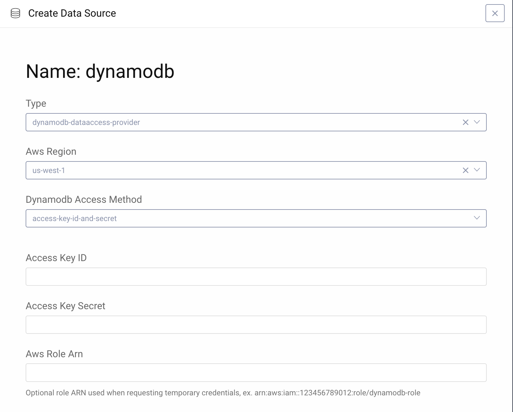

DynamoDBDataAccessProvider Data Access Provider Plugin
=============================================

.. image:: https://img.shields.io/badge/quality-demo-red
    :target: https://curity.io/resources/code-examples/status/

.. image:: https://img.shields.io/badge/availability-source-blue
    :target: https://curity.io/resources/code-examples/status/

A Data Access Provider Plugin for the Curity Identity Server which uses the AWS DynamoDB as the data source.

Building the Plugin
~~~~~~~~~~~~~~~~~~~

You can build the plugin by issuing the command ``mvn package``. This will produce JAR files for the plugin and all
the required dependencies. The JAR files will be created in the ``target`` directory.

Installing the Plugin
~~~~~~~~~~~~~~~~~~~~~

To install the plugin, copy all of the created JARs into the :file:`${IDSVR_HOME}/usr/share/plugins/${pluginGroup}`
on each node, including the admin node. For more information about installing plugins, refer to the `curity.io/plugins`_.

Enabling and configuring the Plugin
~~~~~~~~~~~~~~~~~~~~~~~~~~~~~~~~~~~

To enable Dynamo DB as a data source open the **Facilities** menu located in the top right corner of the admin UI, and
click the **New** button in the **Data Sources** section. Choose a suitable name and click **Create**.
Next choose ``dynamodb-dataaccess-provider`` as the type of the provider, and fill in the appropriate AWS settings:

1. Choose the region of your DynamodDB database.
2. Configure access to the database by choosing one of the options:

- ``access-key-id and secret``. You must provide the access key and secret in appropriate fields. Optionally, you can
  set the ARN role which will be used when obtaining credentials.
- ``awsprofile``. You must provide the profile name which will be used to retrieve credentials from the system. Optionally,
  you can set the ARN role which will be used when obtaining credentials.
- ``ec2-instance-profile``. You can enable this setting to use an EC2 Instance Profile for DynamoDB access. This allows
  for assigning an IAM Role with DynamoDB permissions directly to an EC2 instance.

If Aws Role Arn is defined an AssumeRole attempt will be made with the credentials found, either from config (Access Key ID
and Access Key Secret) or from profile. The credentials then don't have to have direct access to DynamoDB but instead need
to have access to the role that will provide temporary credentials to access DynamoDB.

Tables and indexes used
~~~~~~~~~~~~~~~~~~~~~~~

1. Table: curity-accounts

- partition key: userName (String)
- indexes:
    a. email-index
        - partition key: email (String)
    b. phone-index
        - partition key: phone (String)

2. Table: curity-bucket

- partition key: subject (String)
- sort key: purpose (String)

3. Table: curity-delegations

- partition key: id (String)
- indexes:
    a. id-status-index
        - partition key: id (String)
        - sort key: status (String)
    b. owner-status-index
        - partition key: owner (String)
        - sort key: status (String)
    c. authorization-hash-index
        - partition key: authorizationCodeHash (String)

4. Table: curity-devices

- partition key: id (String)
- indexes:
    a. accountId-deviceId-index
        - partition key: accountId (String)
        - sort key: deviceId (String)

5. Table: curity-dynamic-clients

- partition key: clientId (String)

6. Table: curity-links

- partition key: localIdToforeignIdAtdomainForManager (String)
- indexes:
    a. resolve-link-index
        - partition key: foreignIdAtDomain (String)
        - sort key: linkingAccountManager (String)
    b. list-links-index
        - partition key: localAccountId (String)
        - sort key: linkingAccountManager (String)

7. Table: curity-nonces

- partition key: nonce (String)

8. Table: curity-sessions

- partition key: id (String)

9. Table: curity-tokens

- partition key: tokenHash (String)
- indexes:
    a. id-index
        - partition key: id (String)

More Information
~~~~~~~~~~~~~~~~

Please visit `curity.io`_ for more information about the Curity Identity Server.

.. _curity.io/plugins: https://support.curity.io/docs/latest/developer-guide/plugins/index.html#plugin-installation
.. _curity.io: https://curity.io/
